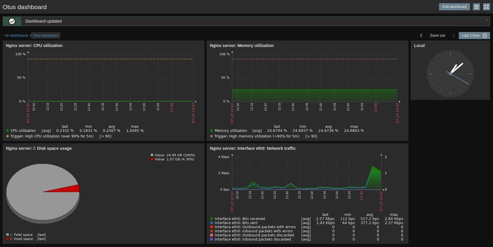

## ДЗ - 15  

Наверное можно было установить всё ручками и не заморачиваться, или взять предложенный стенд.
Но чукча лёгких путей не ищет.

Поэтому план был таков: тренируемся на ~~кошках~~ стенде vagrant, отрабатываем раскатку ansibl'ом, 
а потом развернём на облачеых виртуалках с помощью полученной роли.

Проблема возникла следующая:
Если я ставил ставил `NGINX` из `epel-release` и/или `php-fpm` из `remi`
то фронт заббикса у не работал. И это было долго и больно.

Но если мы таки воспользуемся магией RTFM
https://www.zabbix.com/download?zabbix=5.0&os_distribution=centos&os_version=7&db=mysql&ws=nginx
https://www.zabbix.com/documentation/5.0/manual/installation/frontend/frontend_on_rhel7

И кинем пару очков в интеллект, а не харизму (кому она нужна при подключении по ssh??) то всё получится.

Итак, у нас всё установленно, nginx запустился и нас приветствует окно установки zabbix.
Как-то не очень. Поэтому мы выполним настройки, получим сообщение

> Configuration file "/etc/zabbix/web/zabbix.conf.php" created.  

И сделаем шаблон на основе этого файла. - `zabbix/templates/zabbux.conf.j2`

Итого:
роль `palybooks/agent.yml` разворачивает nginx на 8080 порту и `zabbix-agent`,
а `palybooks/zabbix.yml` разворачивает zabbix с nginx/mysql.
Теперь, когда отработана установка на vagrant'е, не замахнуться ли нам 
~~на Вильяма, понимаете ли, нашего Шекспира?~~ и раскатать наши плейбуки на
что-нибудь более ощутимое? Тут как раз ~~рояль в кустах~~ есть парочка впс-ок на digital ocean'е

ВМ              internal IP external IP
otus-15-zbx-01  10.114.0.2  207.154.200.37
otus-15-ngx-02  10.114.0.3  178.128.198.8

теперь можно посмотреть графики на стенде - http://ots-zbx.bsvv.pp.ua:8080  
login:  otus  
passwd: 0tusPa$$w0rD  

